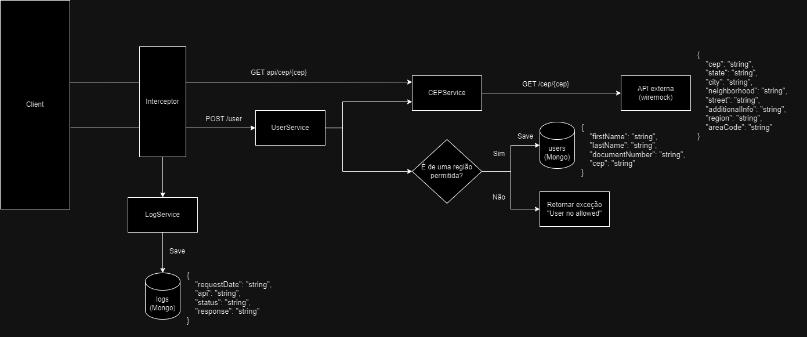

# CEP Info API
## Descrição

Este projeto é uma REST API desenvolvida para obter informações adicionais de um CEP.

## Tecnologias Utilizadas

- **Linguagem**: Java
- **Framework**: Spring Boot
- **Banco de Dados**: MongoDB
- **Testes**: JUnit, Mockito

## Funcionalidades

- **API de Detalhes de CEP**: A API permite obter informações detalhadas de um determinado CEP a partir de um API externa (wiremock).
- **API para Criação de Usuários**: A API permite a inserção de um usuário no banco, validando a permissão baseado no cep do mesmo.
- **Sistema de logs baseado em chamadas**: Cada chamada inserida com a anotção @Loggable será salva em banco com informações como: api chamada, data, resposta e status.

## Endpoints

- **GET /cep/:cep**
- **POST /user/:code**


## Instalação e Uso

1. Clone o repositório:
    ```bash
    git clone https://github.com/almeidagianluca/cep-info-api.git
    ```

2. Instale as dependências do projeto:
    ```bash
    mvn clean install
    ```

3. Executar comando para subida de constainers docker dentro da pasta externalfiles
    ```bash
    docker-compose up
    ```


4. Execute a aplicação:
    ```bash
    mvn spring-boot:run
    ```

## URLs Disponíveis

1. **Aplicação Spring**: `http://localhost:8080`
2. **Mongo Express**: `http://localhost:8082/`
3. **Wiremock**: `http://localhost:8383/`

## Desenho de Solução



## Testes

Para rodar os testes unitários, utilize o comando:
```bash
mvn test
```


